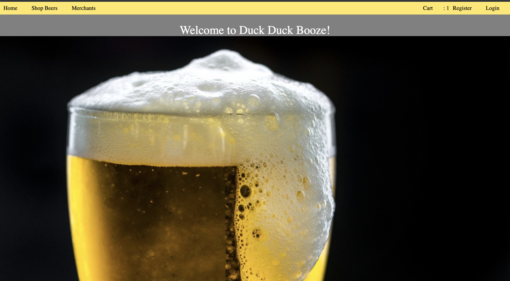

# README

DuckDuckBooze is a four person group project that is part of the Turing School of Sofware and
Design's Backend Engineering Module 2 curriculum.  The aim of the project is to hone the following skills:

- Advanced Rails routing (nested resources and namespacing)
- Advanced ActiveRecord for calculating statistics
- Average HTML/CSS layout and design for UX/UI
- Session management and use of POROs for shopping cart
- Authentication, Authorization, separation of user roles and permissions

The project is an Rails application that acts as an e-commerce platform where users can place different selections of beer into a shopping cart and check out to purchase all of the items if they have also registered. Merchants can specify different selections of beer as "fulfilled" and the last merchant to do this for a specific order will automatically set the current order status (enum) to "shipped". Each user has roles and these roles vary the user's authorization to access some functionality within the models.

The following is a screenshot of the root landing page: 

* Ruby version

* System dependencies

* Configuration

* Database creation

* Database initialization

* How to run the test suite

* Services (job queues, cache servers, search engines, etc.)

* Deployment instructions

* ...
